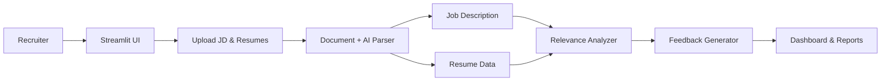

# 🚀 AI-Powered Resume Screening App

Streamline hiring with an AI-assisted tool that quickly screens resumes against job descriptions. Built with **Streamlit** and optional **Gemini AI** for smarter parsing.

---

## ✨ Features

* 📂 Upload Job Description (PDF/DOCX)
* 📑 Upload multiple resumes (PDF/DOCX)
* ⚡ Extract text using robust fallback parsers
* 🤖 AI-powered parsing (Gemini API) or fallback regex
* 🎯 Hard skill & semantic matching for fair scoring
* 📊 Dashboard with results, analytics & shortlists
* 📝 Downloadable reports and email list
* 🎥 Demo video support (upload/play inside app)

---

## 🛠️ Setup

### Requirements

* Python 3.8+
* Install dependencies:

```bash
pip install streamlit pandas plotly google-generativeai PyPDF2 python-docx numpy
pip install pdfplumber PyMuPDF docx2txt textract   # optional, for better parsing
```

### (Optional) Gemini API

Create `.streamlit/secrets.toml`:

```toml
GEMINI_API_KEY = "your_api_key_here"
```

### Run

```bash
streamlit run resume_screening_fixed.py
```

👉 App opens at `http://localhost:8501`

---

## 🎥 Demo Video

Add your demo at `assets/demo.mp4` or upload via app.

```python
st.video("assets/demo.mp4")
```

---

## 🔎 Architecture



---

## ✅ Perfect for Hackathons

* Clear **workflow**
* Clean **UI with Streamlit**
* Scalable idea → add OCR, embeddings, or DB later

---

## 📜 License

MIT License — use freely.

---

💡 *Tip: Keep demo simple, show upload → scoring → results in action!*
